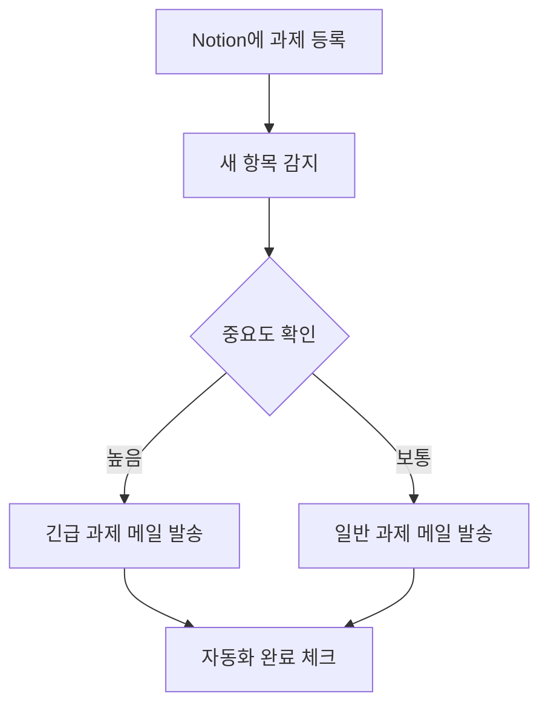

## 1. 프로젝트 개요

본 프로젝트에서는 Notion 과제 관리 데이터베이스에 새로운 과제가 등록되면 중요도에 따라 과제를 분류하고, Gmail로 알림을 발송한 뒤 Notion의 **자동화 완료** 항목을 체크하는 워크플로를 구현하였다. 동일한 자동화를 Make와 Zapier에서 각각 구성하여 두 도구의 차이를 비교하였다.

### 자동화 목적

- Notion에 등록된 과제를 별도로 확인해야 하는 반복 작업을 줄인다.
- 중요도에 따라 긴급 과제와 일반 과제를 구분하여 알림을 발송한다.
- 메일 발송 이후 **자동화 완료** 값을 변경하여 처리 여부를 확인한다.
- 같은 워크플로를 두 도구로 구현하여 실제 사용 편의성을 비교한다.

<aside>
📌

**자동화 대상:** Notion 과제 등록 및 이메일 알림

**비교 도구:** Make, Zapier

**연동 서비스:** Notion, Gmail

</aside>

## 2. 공통 워크플로 설계

### 사용한 Notion 속성

| 속성 | 용도 |
| --- | --- |
| 과제명 | 메일 제목과 본문에 과제 이름 표시 |
| 과목 | 과제가 속한 과목 표시 |
| 마감일 | 제출 기한 안내 |
| 중요도 | 높음과 보통 조건 분기 |
| 상태 | 과제 진행 상태 표시 |
| 자동화 완료 | 메일 발송과 후속 처리가 끝났는지 확인 |

## 3. Make 구현

Make에서는 Notion의 **Watch Data Source Items** 모듈을 트리거로 사용하였다. Router를 이용하여 중요도가 **높음**인 경우와 **보통**인 경우를 두 경로로 분리하고, 각 경로에서 Gmail로 알림 메일을 발송하도록 구성하였다. 메일 발송 후에는 Notion의 **Update a Data Source Item** 모듈이 같은 과제 항목의 **자동화 완료** 값을 체크한다.

### Make 실행 순서

1. Notion 데이터베이스의 새 과제 감지
2. Router에서 중요도 확인
3. 중요도에 맞는 Gmail 알림 발송
4. 해당 Notion 항목의 자동화 완료 체크

### Make 구현 화면

**그림 1. Make 전체 시나리오 구성**

!Make_구성_화면.svg

Make는 Notion 트리거 이후 Router에서 긴급 과제와 일반 과제로 분기하고, 각 경로에서 Gmail 발송과 Notion 업데이트를 차례로 수행하도록 구성하였다.

- Make 세부 설정 화면 보기
    
    **그림 2. Notion 신규 과제 감지 설정**
    
    !Make_Notion_트리거.svg
    
    Notion 데이터 소스의 새 항목을 생성 시간 기준으로 감지하도록 설정하였다.
    
    **그림 3. 긴급 과제 필터**
    
    !Make_긴급_과제_필터.svg
    
    중요도가 **높음**인 항목만 긴급 과제 경로로 통과한다.
    
    **그림 4. 일반 과제 필터**
    
    !Make_일반_과제_필터.svg
    
    중요도가 **보통**인 항목만 일반 과제 경로로 통과한다.
    
    **그림 5. 긴급 과제 Gmail 본문 설정**
    
    !Make_긴급_메일_설정.svg
    
    **그림 6. 일반 과제 Gmail 본문 설정**
    
    !Make_일반_메일_설정.svg
    
    두 메일에는 과제명, 과목, 마감일, 중요도, 상태를 Notion 속성에서 연결하였다.
    
    **그림 7. 자동화 완료 체크 설정**
    
    !Make_자동화_완료_설정.svg
    
    메일 발송 후 같은 과제 항목의 **자동화 완료** 값을 Yes로 변경하도록 설정하였다.
    

## 4. Zapier 구현

Zapier에서는 Notion의 **New Data Source Item**을 트리거로 사용하였다. Paths 기능으로 중요도가 **높음**인 Path A와 **보통**인 Path B를 만들고, 각 경로에 Gmail의 **Send Email**과 Notion의 **Update Data Source Item** 단계를 배치하였다. 마지막 Notion 업데이트 단계에서는 트리거에서 받은 항목 ID를 연결하여 같은 과제의 **자동화 완료** 값을 체크하였다.

### Zapier 실행 순서

1. Notion 데이터베이스의 새 과제 감지
2. Paths에서 중요도 조건 판별
3. 해당 경로에서 Gmail 알림 발송
4. 트리거 항목 ID를 이용하여 자동화 완료 체크

### Zapier 구현 화면

**그림 8. Zapier 전체 워크플로 구성**

!Zapier_전체_구성.svg

Zapier에서는 새 Notion 항목을 감지한 뒤 Paths로 긴급 과제와 일반 과제를 구분하고, 각 Path에서 Gmail 발송과 Notion 업데이트를 실행하도록 구성하였다.

- Zapier 세부 설정 화면 보기
    
    **그림 9. 긴급 과제 Path 조건**
    
    !Zapier_긴급_Path_조건.svg
    
    조건값이 **높음**과 정확히 일치할 때 긴급 과제 Path가 실행된다. 화면의 ‘보통’ 표시는 테스트에 사용된 샘플 데이터이며, 실제 비교 조건은 ‘높음’이다.
    
    **그림 10. 일반 과제 Path 조건**
    
    !Zapier_일반_Path_조건.svg
    
    조건값이 **보통**과 정확히 일치할 때 일반 과제 Path가 실행된다.
    
    **그림 11. 긴급 과제 Gmail 설정**
    
    !Zapier_긴급_메일_설정.svg
    
    **그림 12. 일반 과제 Gmail 설정**
    
    !Zapier_일반_메일_설정.svg
    
    두 Path의 메일 제목과 본문에 Notion의 과제 속성을 연결하였다. 긴급 설정 화면에 표시된 ‘보통’ 값 역시 테스트 샘플 데이터이며 실제 Path 조건과는 별개이다.
    
    **그림 13. Notion 자동화 완료 설정**
    
    !Zapier_자동화_완료_설정.svg
    
    트리거에서 받은 항목 ID를 연결하고 **자동화 완료** 값을 true로 변경하도록 설정하였다.
    

## 5. 실행 결과

Notion에 테스트 과제를 등록하여 두 도구의 작동 여부를 확인하였다. 중요도가 **높음**인 과제는 긴급 과제 알림 메일로, 중요도가 **보통**인 과제는 일반 과제 알림 메일로 발송되었다. 메일에는 과제명, 과목, 마감일, 중요도, 상태가 표시되었으며, 발송 이후 해당 과제의 **자동화 완료** 항목이 체크되는 것을 확인하였다.

| 확인 항목 | 결과 |
| --- | --- |
| 새 과제 감지 | 정상 작동 |
| 중요도 조건 분기 | 높음과 보통 경로로 구분 |
| Gmail 알림 | 긴급 과제와 일반 과제 메일 수신 |
| Notion 후속 업데이트 | 자동화 완료 항목 체크 |

### 5-1. Make 최종 구현 결과

**그림 14. Make 과제 등록 직후 화면**

!project1_make_notion_before.svg

긴급 과제와 일반 과제를 등록한 직후에는 두 항목의 **자동화 완료**가 체크되지 않은 상태임을 확인하였다.

**그림 15. Make 실행 후 자동화 완료 체크 결과**

!project1_make_notion_after.svg

시나리오 실행 후 두 과제 모두 **자동화 완료**가 체크되어 후속 업데이트가 정상 처리된 것을 확인하였다.

**그림 16. Make 긴급·일반 과제 알림 메일 수신 결과**

!project1_make_email_result.svg

중요도에 따라 긴급 과제와 일반 과제 메일이 각각 발송된 것을 확인하였다.

**그림 17. Make 시나리오 실행 성공 로그**

!project1_make_execution_log.svg

실행 이력에서 시나리오가 Success 상태로 완료되고 각 모듈의 작업이 처리된 것을 확인하였다.

### 5-2. Zapier 최종 구현 결과

**그림 18. Zapier 긴급 과제 등록 직후 화면**

!project1_zapier_urgent_before.svg

**그림 19. Zapier 일반 과제 등록 직후 화면**

!project1_zapier_normal_before.svg

긴급 과제와 일반 과제를 각각 등록하고 자동화 실행 전에는 **자동화 완료**가 체크되지 않은 상태임을 확인하였다.

**그림 20. Zapier 실행 후 자동화 완료 체크 결과**

!project1_zapier_notion_after.svg

두 과제 모두 Gmail 발송 후 **자동화 완료**가 체크된 것을 확인하였다.

**그림 21. Zapier 긴급·일반 과제 알림 메일 수신 결과**

!project1_zapier_email_result.svg

받은편지함에서 긴급 과제와 일반 과제 알림 메일이 각각 수신된 것을 확인하였다.

## 6. 비교 기준

두 도구는 초기 설정 난이도, 무료 사용 범위, 분기 및 확장 편의성, 테스트·오류 확인, 시각성과 유지관리의 다섯 가지 기준으로 평가하였다. 각 항목은 5점 만점이며 총점은 25점이다.

## 7. Make vs. Zapier 비교 분석

| 비교 기준 | 평가 내용 | Make | Zapier |
| --- | --- | --- | --- |
| 1. 초기 설정 난이도 | 앱 연결, 데이터베이스 선택, 속성 연결이 쉬운가 | 3 | 4 |
| 2. 무료 사용 범위 | 무료 실행량과 다단계·분기 기능을 사용할 수 있는가 | 5 | 2 |
| 3. 분기 및 확장 편의성 | 조건 분기와 추가 액션을 쉽게 구성할 수 있는가 | 5 | 3 |
| 4. 테스트·오류 확인 | 테스트 결과와 어느 단계에서 오류가 발생했는지 확인하기 쉬운가 | 4 | 3 |
| 5. 시각성과 유지관리 | 전체 구조를 파악하고 나중에 수정하기 쉬운가 | 5 | 3 |
| 합계 | 25점 만점 | 22점 | 15점 |

## 8. 비교 결과 및 최종 선정

Make는 Router를 이용한 분기 구조가 화면에 명확하게 표시되고, 각 모듈의 입출력과 오류 발생 지점을 확인하기 쉬웠다. 또한 무료 범위에서 다단계 시나리오와 분기 기능을 활용할 수 있다는 점이 장점이었다. 다만 모듈별 설정 항목이 많아 처음 사용할 때는 구조를 익히는 과정이 필요했다.

Zapier는 단계별 설정 화면이 단순하여 기본 자동화를 처음 구성할 때 비교적 쉽게 접근할 수 있었다. 그러나 이번 워크플로에 필요한 Paths와 다단계 기능은 유료 기능의 영향을 받았으며, 무료 체험이 종료되면 게시한 Zap이 비활성화될 수 있다는 제한이 있었다.

<aside>
🏆

**최종 선정 도구: Make**

이번 과제에서는 조건 분기, 무료 사용 범위, 실행 과정 확인, 전체 구조의 시각성을 종합적으로 고려하여 Make를 더 적합한 도구로 선정하였다. Zapier가 초기 설정은 조금 더 간단했지만, 두 개의 경로와 여러 액션이 필요한 워크플로를 지속적으로 운영하기에는 Make가 더 유리하다고 판단하였다.

</aside>
